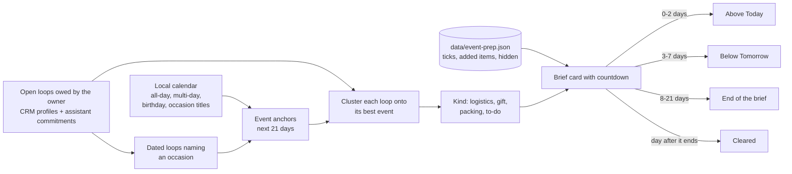
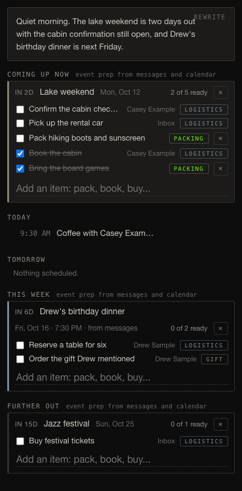

# Event prep in the daily brief

Every open loop tied to an upcoming dated event (a trip, a birthday, a
dinner, a festival) is gathered into one countdown checklist. The checklist
climbs the brief as the date nears and clears the day after the event ends.
Code: `server/eventprep.py`; brief wiring in `server/brief.py` and
`renderEventPrep` in `static/app.js`.

Screenshots use synthetic data injected into the real renderer on a fixture
test instance; no owner data appears in them.
